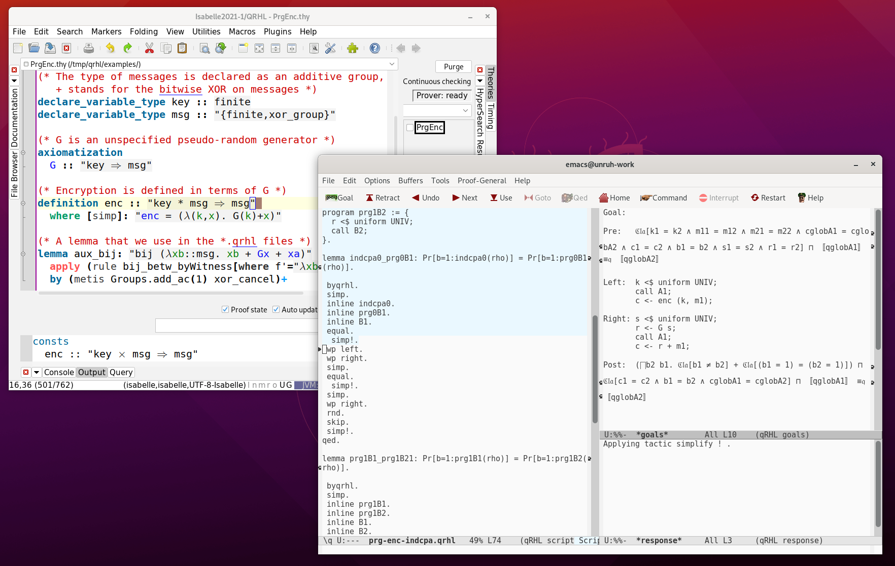

# qrhl-tool – Interactive theorem prover for qRHL

Qrhl-tool is an interactive theorem prover for qRHL (quantum relational Hoare logic),
specifically for quantum and post-quantum security proofs.

See the literature section for pointers for more in-depth explanations

## Installation

See [here](install.md) for installation instructions.

## Documentation and help

* The [user manual](manual-0.6.pdf), included in the binary installation as `manual.pdf`
* Example files, included in the binary installation in `examples/`
* The [quickstart guide](quickstart_guide-qRHL-tool.pdf) contributed by Tejas Shah
* [Gitter chat](https://gitter.im/dominique-unruh/qrhl-tool)

## Papers

* [Quantum Relational Hoare Logic](https://arxiv.org/abs/1802.03188), POPL 2019 – introduces the logic underlying the tool (recommended background!)
* [Local Variables and Quantum Relational Hoare Logic](https://arxiv.org/pdf/2007.14155.pdf) – describes extensions of qRHL to handle local variables, used in qrhl-tool
* [Post-Quantum Verification of Fujisaki-Okamoto](https://eprint.iacr.org/2020/962.pdf), Asiacrypt 2020 – describes the formalization of a Fujisaki-Okamoto variant in qrhl-tool.

## Under the hood

The qrhl-tool uses a number of open-source libraries and tools, the most notable dependencies are:

* The [Isabelle](https://isabelle.in.tum.de/) theorem prover: for all non-qRHL specific reasoning.
* [scala-isabelle](https://github.com/dominique-unruh/scala-isabelle): a library for controlling Isabelle within Scala.
* [Complex_Bounded_Operators](https://www.isa-afp.org/entries/Complex_Bounded_Operators.html): An Isabelle formalization of complex bounded operators, building the foundation for the modeling of quantum mechanics in qrhl-tool.
* Many more library dependencies, see the [build script](https://github.com/dominique-unruh/qrhl-tool/blob/master/build.sbt).
